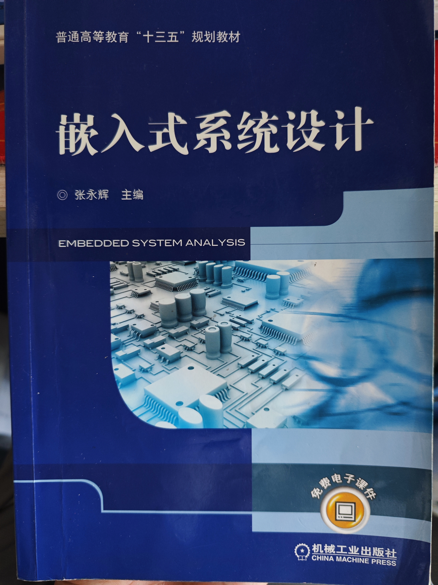
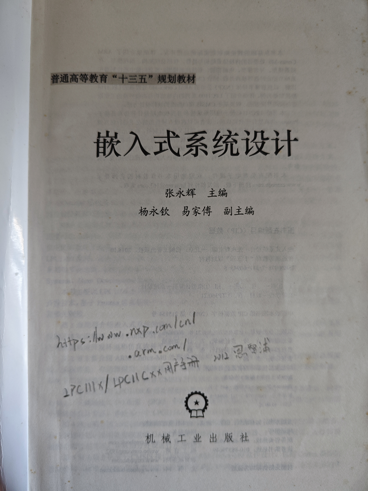
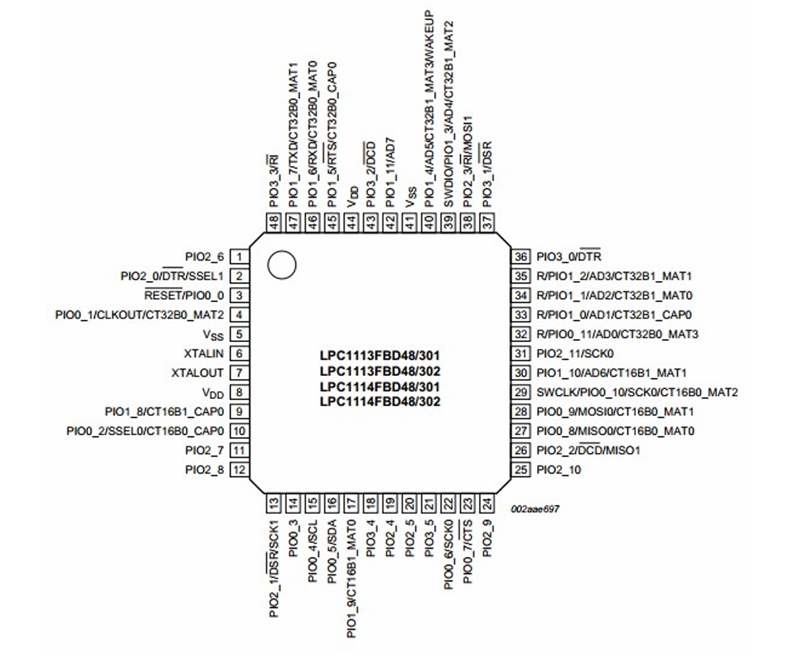
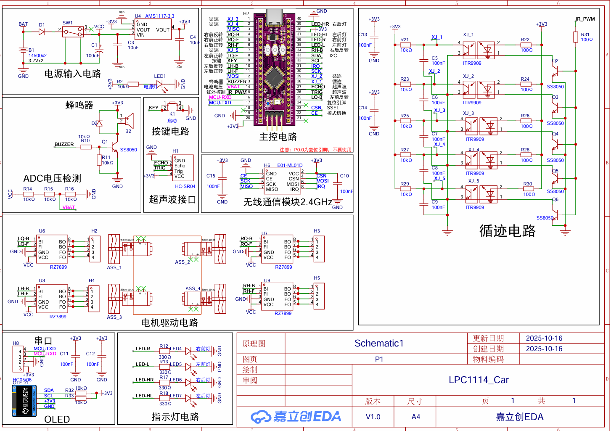
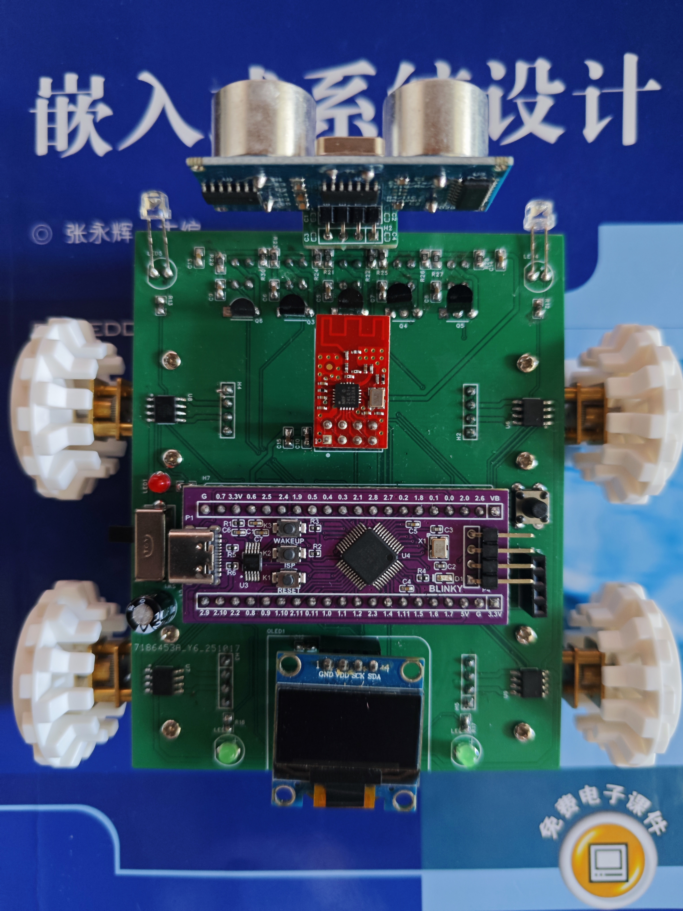
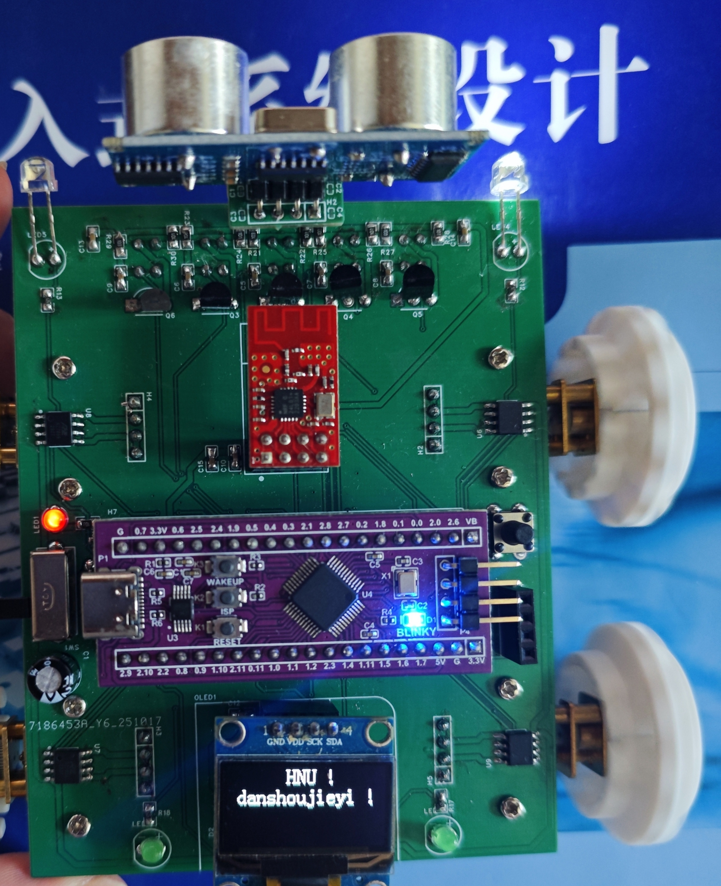

# LPC1114_CAR
## 前言
**让你的NXP LPC1114单片机飞起来！像开发STM32一样简单！**

在人工智能时代，单片机开发已经从寄存器开发进阶到了库函数开发、CubeMX图形化开发。即使是TI德州仪器的单片机都能使用图形化开发工具，甚至很多国产芯片也都有对应的图形化开发工具。

开发工具进化如此之快的时代，但HNU的信通院电子系的学子，不得不学习使用十六年前的远古芯片LPC1114，不得不忍受十三五规划教材《嵌入式系统设计》最原始的开发方式，不得不翻看这本写得晦涩难懂的书，绝大部分的开发时间都浪费在找寄存器表上面，甚至有可能找出来的还是错误的信息。

**现在！不用担心了！使用本项目封装的库函数和RT-Thread NANO操作系统，抛弃掉书籍和寄存器开发方式，让你的LPC1114开发像STM32一样简单！**
## 项目介绍
**本项目为HNU的嵌入式系统设计课程指定开发板NXP LPC1114，封装了完整的库函数并且搭建了含RT-Thread实时操作系统的工程模板文件**

主要功能是：使用KEIL5+VSCODE配合嵌入式操作系统（RT-Thread NANO）优雅的开发NXP LPC1114单片机。
### 项目使用环境和工具
使用代码编译环境为：KEIL5 MDK-Arm-v5.39

编译器版本：default version 6

项目开发工具配合使用：VSCODE、KEIL5、SSCOM串口助手、VOFA+上位机
### 项目内容
项目内容包括：

（1）	一个没有使用操作系统的NXP LPC1114库函数封装和工程模板文件

（2）	一个使用RT-Thread操作系统的NXP LPC1114库函数封装和工程模板文件

### 本项目主要目的
通过封装NXP LPC1114的底层代码，构建一套完整的标准库函数，舍弃掉寄存器开发方式，使得开发者可以像开发STM32一样简单，并且可以快速的上手RT-Thread操作系统。
## 对应的书籍
《嵌入式系统设计》

## LPC1114引脚功能图

## 本次测试使用的LPC1114小车和原理图

**烧入工程模板文件代码结果如下**
**小车四个轮子前进，OLED显示信息，并且所有车灯交替闪烁**

# 声明
本项目仅供学习交流使用。

本项目库函数封装参考英文网中2009年的一个有关NXP LPC11xx的教学实验箱源码，通过对实验箱源码驱动函数进行裁剪、移植、修改、封装，最终形成了本项目的库函数。

# 如果你觉得对你有帮助，请不要忘记右上角Star☆
